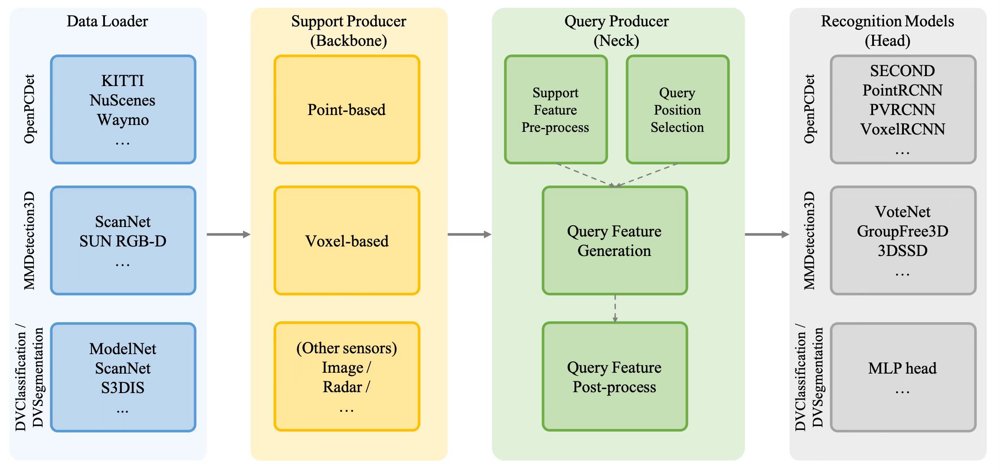

# DV-Lab 3D Toolbox (DeepVision3D)

## Overview
DeepVision3D is an open source toolbox for point-cloud understanding developed by [Deep Vision Lab](https://www.dvlab.ai/). 
It integrates popular publicly available 3D codebases, including [OpenPCDet](https://github.com/open-mmlab/OpenPCDet),
[MMDetection3D](https://github.com/open-mmlab/mmdetection3d), as well as develops [DVClassification](DVClassification)
and [DVSegmentation](DVSegmentation) to facilitate studies on multiple 3D understanding tasks like outdoor / indoor object detection, shape classification and semantic segmentation.
It also maintains the latest 3D research progresses from our lab.


**Highlights**: 
* It integrates multiple popular point cloud understanding codebases to facilitate research on indoor object detection, outdoor object detection, shape classification and semantic segmentation.
* It unifies the implementations of backbones. One can easily define a new backbone network at [here](EQNet/eqnet/models/support_producer) and test it on all available models in different codebases without extra modifications.
* It is the first codebase which enables a free combination between backbones and models regardless of their types: 
  * `E.g. 1:` A point-based backbone can be applied on voxel-based detector, SECOND ([model](OpenPCDet/tools/cfgs/kitti_models/eq_paradigm/ptbased_backbone/second.yaml)); 
  * `E.g. 2:` A voxel-based backbone can be applied on point-based detector, PointRCNN ([model](OpenPCDet/tools/cfgs/kitti_models/eq_paradigm/vxbased_backbone/pointrcnn.yaml));
* It maintains the official implementation of research progresses on understanding point cloud from our lab:
  * A Unified Query-based Paradigm for Point Cloud Understanding ([paper](https://arxiv.org/pdf/2203.01252v3.pdf), [supp](https://drive.google.com/file/d/1fEi-_OmyDuu4ToA7LUBd0MRKanXmIHnY/view?usp=sharing))
  * (To be merged) Stratified Transformer for 3D Point Cloud Segmentation ([paper](https://arxiv.org/pdf/2203.14508.pdf))
  * (To be merged) Focal Sparse Convolutional Networks for 3D Object Detection ([paper](https://arxiv.org/pdf/2204.12463.pdf))
  * (To be merged) Voxel Field Fusion for 3D Object Detection

## DeepVision3D codebase design
DeepVision3D codebase is designed following:
<p align="center">
  
</p>

To be specific, it includes:
* A [Support Producer](EQNet/eqnet/models/support_producer) to extract features with LiDAR, Radar or Image backbones.
* A [Query Producer](EQNet/eqnet/models/query_producer) to bridge the feature representation gap between backbones and heads.
* Specific head implementations for different downstream tasks.

## Installation
Please refer to this [page](docs/Installation.md) to install DeepVision3D toolbox.

## Get Started
To reproduce our result, please refer to:
* [DVClassification](DVClassification/README.md) for shape classification;
* [DVSegmentation](DVSegmentation/README.md) for segmentation;
* [MMDetection3D](MMDetection3D/README.md) for indoor detection;
* [OpenPCDet](OpenPCDet/README.md) for outdoor detection;

## Citation.
If you find our work useful in your research, please consider citing:
```
@misc{Yang2022deepvision3d,
  author =       {Zetong Yang and Li Jiang and others contributors},
  title =        {{DeepVision3D}: A Toolbox for Point Cloud High-level Understanding},
  howpublished = {\url{https://github.com/dvlab-research/DeepVision3D}},
  year =         {2022}
}
```

and relevant publications:
```
@inproceedings{Yang2022eqparadigm,
  author    = {Zetong Yang and Li Jiang and Yanan Sun and Bernt Schiele and Jiaya Jia},
  title     = {A Unified Query-based Paradigm for Point Cloud Understanding},
  booktitle = {Proceedings of the IEEE Conference on Computer Vision and Pattern Recognition},
  year      = {2022},
}
```

## Contact
If you have any questions or suggestions about this repo, please feel free to contact me (tomztyang@gmail.com).